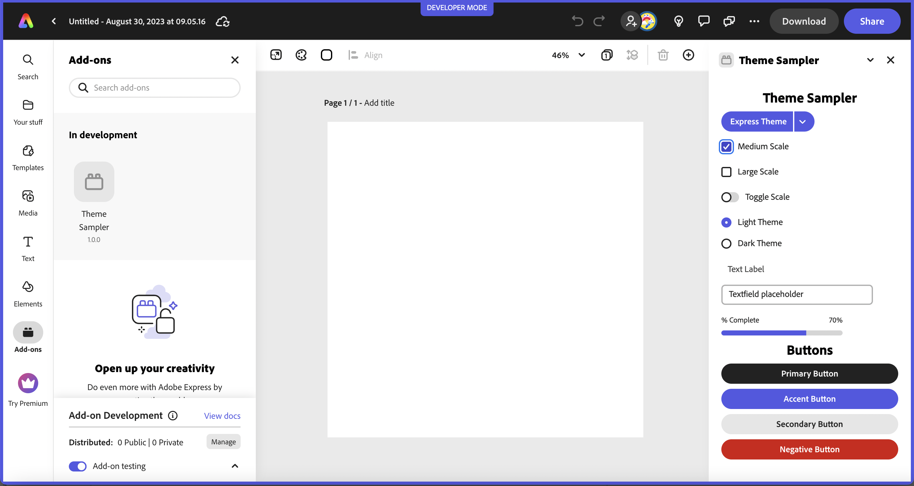
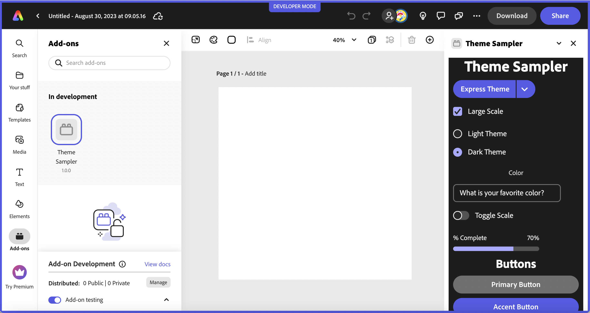

## About

This project has been created with _@adobe-ccwebext/create-ccweb-add-on_. As an example, this add-on demonstrates the use of the [SWC-React](https://opensource.adobe.com/spectrum-web-components/using-swc-react/), (React wrapper components for the Spectrum Web Components (SWC) library), as well as how to set the various theme properties provided with Spectrum (ie: main theme, scale, color and style). 

## Important Notes
### SWC-React Note
For the SWC-React use, please note that you only need to include the `swc-react` package for the component you want to use in your `package.json`, though you need to import both components when actually using it in the `App.jsx`.

```js
import '@spectrum-web-components/button/sp-button.js';
import { Button } from "@swc-react/button";
```

The corresponding Spectrum Web Component module is automatically brought in when you specify it's related `swc-react` component in your `package.json`.

### Theme Note
Currently Express only supports the light theme, but a dark theme will be coming in the future so you should be considering that when designing your add-on.




## Tools

-   HTML
-   CSS
-   React
-   [SWC-React](https://opensource.adobe.com/spectrum-web-components/using-swc-react/) 

## Setup

1. To install the dependencies, run `npm install`.
2. To build the application, run `npm run build`.
3. To start the application, run `npm run start`.
