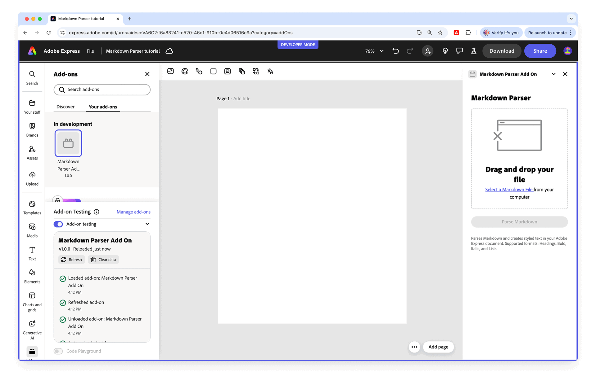

# Markdown Parser Add-on

This sample add-on demonstrates how to build an Adobe Express add-on capable of parsing Markdown files and converting them into rich text directly within an Adobe Express document.

## Follow the tutorial

This sample is described in the tutorial [Create a Markdown Parser Add-on with the Text API](https://developer.adobe.com/express/add-ons/docs/guides/learn/how_to/tutorials/markdown-parser-text-api/).

## What you'll learn

- Creating an interactive **drag-and-drop user interface** with **Spectrum Web Components**.
- Integrating **file upload** and parsing mechanisms.
- The power of the **Text API**.
- Applying **fonts** using the Document API.
- Advanced **character styling**: font size and weight.
- Advanced **paragraph styling**: alignment and list styles.

## Setup

- You can start (almost) from scratch and follow the tutorial (`express-markdown-parser-addon-start`), or run the final result (`express-markdown-parser-addon-end`).

1. To install the dependencies, run `npm install`.
2. To build the application, run `npm run build`.
3. To start the application, run `npm run start`.
