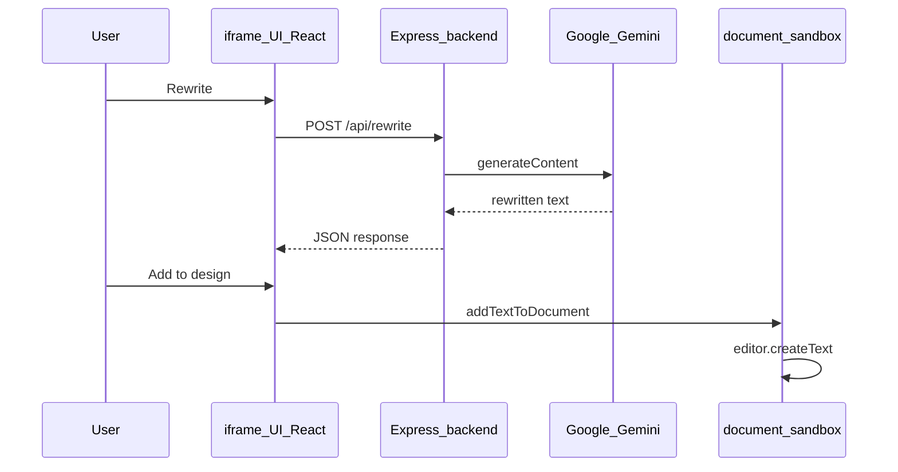

# Add-on with Backend

This sample shows how to connect an **Adobe Express add-on** to your own **Node.js / Express** backend. The add-on sends text to the server; the server rewrites it with **Google Gemini** (`@google/genai`) and returns the result. The API key stays on the server only.

## What you will learn

- How the add-on panel (`fetch`) talks to an Express API
- Why you need an **HTTPS URL** for the API during local development
- Why **CORS** matters and how to fix common errors
- Why network calls belong in the **UI runtime**, not the document sandbox
- How to add rewritten text to the canvas via the **document sandbox**

## Architecture



## Folder structure

```text
add-on-with-backend/
├── README.md          ← you are here
├── add-on/            ← React + document sandbox
└── backend/           ← Express + Gemini (HTTP on localhost)
```

## Local development vs production

| Environment    | Backend                                          | `API_BASE_URL` in add-on                                   |
| -------------- | ------------------------------------------------ | ---------------------------------------------------------- |
| **Local**      | Run Express on `http://localhost:PORT`           | **HTTPS tunnel URL** that forwards to that port (required) |
| **Production** | Deploy Express with HTTPS (Render, Fly.io, etc.) | Your **deployed** `https://api.example.com` URL            |

The add-on panel always uses **HTTPS** (`https://localhost:5241` locally, or `https://abc123.wxp.adobe-addons.com` when distributed). The browser **blocks** `fetch("http://localhost:...")` from that page (mixed content). Opening CORS with `*` does not fix this.

You need a **tunnel** (or IDE port forward) that exposes your local backend as a **public HTTPS URL**.

## Local development: HTTPS tunnel

### Step 1 — Start the backend

```bash
cd backend
npm install
cp .env.example .env
# Edit .env: GEMINI_API_KEY, PORT (default 3001)
npm run dev
```

Check: [http://localhost:3001/health](http://localhost:3001/health) → `{"status":"ok"}` (use your `PORT` if different).

### Step 2 — Forward the backend port to HTTPS

Pick one method below. Forward the same port as `PORT` in `backend/.env` (default **3001**).

#### Option A — VS Code / Cursor (Ports panel)

1. Run the backend so the port appears under **PORTS** (or add it manually).
2. Right-click the port (e.g. `3001`) → **Port Visibility** → **Public** (if available).
3. Copy the **Forwarded Address** — it must start with `https://` (e.g. `https://xxxx.devtunnels.ms`).
4. Test: open `https://YOUR_FORWARDED_URL/health` in a browser.

#### Option B — ngrok

```bash
# Install: https://ngrok.com/download
ngrok http 3001
```

Copy the **Forwarding** HTTPS URL (e.g. `https://abc123.ngrok-free.app`).

#### Option C — Cloudflare Tunnel (cloudflared)

```bash
# Install: https://developers.cloudflare.com/cloudflare-one/connections/connect-apps/install-and-setup/installation/
cloudflared tunnel --url http://localhost:3001
```

Copy the generated `https://....trycloudflare.com` URL.

### Step 3 — Point the add-on at the HTTPS URL

Edit [add-on/src/config.js](add-on/src/config.js):

```js
export const API_BASE_URL = "https://YOUR_TUNNEL_URL";  // no trailing slash
```

Rebuild the add-on after changing config:

```bash
cd add-on
npm run build
npm run start
```

### Step 4 — Sideload and test

1. Enable **Add-on Development** in Adobe Express.
2. Connect to `https://localhost:5241`.
3. Type text → **Rewrite** → **Add to design**.

If Chrome asks for **Local Network Access**, click **Allow**.

## Quick start (checklist)

1. Terminal A: `cd backend && npm install && cp .env.example .env && npm run dev`
2. Forward port → copy **HTTPS** URL
3. Set `API_BASE_URL` in `add-on/src/config.js`
4. Terminal B: `cd add-on && npm install && npm run build && npm run start`
5. Sideload in Express and test

## Configuration

| File                           | Purpose                                                                |
| ------------------------------ | ---------------------------------------------------------------------- |
| `backend/.env`                 | `GEMINI_API_KEY`, `PORT`, `CORS_ORIGINS`                               |
| `add-on/src/config.js`         | `API_BASE_URL` — **HTTPS** tunnel (local) or deployed API (production) |
| `add-on/src/config.example.js` | Example values                                                         |

**Never** put `GEMINI_API_KEY` in the add-on. Anyone can read client-side source.

### Mock mode (no API key)

If `GEMINI_API_KEY` is missing, the backend returns a mock string so you can test the flow without Gemini.

## CORS

CORS is separate from mixed content. After requests reach your server, the backend must allow the **add-on origin**.

The browser sends:

`Origin: https://localhost:5241`

even when the request URL is your ngrok/tunnel address. This sample allows that origin in [backend/src/cors.js](backend/src/cors.js).

### Troubleshooting

| Symptom                                    | Likely cause                      | Fix                                     |
| ------------------------------------------ | --------------------------------- | --------------------------------------- |
| Mixed content / blocked `http://localhost` | HTTPS add-on calling HTTP API     | Use HTTPS tunnel URL in `config.js`     |
| `Load failed` / TypeError                  | Wrong or missing `API_BASE_URL`   | Set tunnel URL; rebuild add-on          |
| `CORS origin not allowed`                  | Origin not in allow list          | Add to `CORS_ORIGINS` in `backend/.env` |
| Chrome Local Network Access                | Chrome 142+                       | Click **Allow**                         |
| Tunnel URL changed                         | Free ngrok/cloudflare URL rotated | Update `config.js` and rebuild          |

### Verify in DevTools

1. Inspect the add-on panel → **Network** → `rewrite` request.
2. Request URL should be `https://...` (your tunnel or production API), not `http://localhost`.
3. Response should include `Access-Control-Allow-Origin: https://localhost:5241`.

## Production

1. Deploy the Express app to a host with **HTTPS** (AWS, Railway, Render, Fly.io, Vercel serverless adapter, etc.).
2. Set environment variables on the host (`GEMINI_API_KEY`, `CORS_ORIGINS` with your `*.wxp.adobe-addons.com` subdomain).
3. Set `API_BASE_URL` in `add-on/src/config.js` to your production API URL.
4. Package and distribute the add-on.

## API reference

| Method | Path           | Body                | Response                     |
| ------ | -------------- | ------------------- | ---------------------------- |
| GET    | `/health`      | —                   | `{ "status": "ok" }`         |
| POST   | `/api/rewrite` | `{ "text": "..." }` | `{ "rewrittenText": "..." }` |

## Technology used

**Add-on:** React, Spectrum Web Components (`@swc-react`), document sandbox, webpack

**Backend:** Express, `@google/genai`, `dotenv`

## Related samples

- [import-images-using-oauth](../import-images-using-oauth) — OAuth to third-party APIs
- [licensed-addon](../licensed-addon) — HTTP calls to external licensing APIs
- [use-client-storage](../use-client-storage) — persist UI state in the panel
