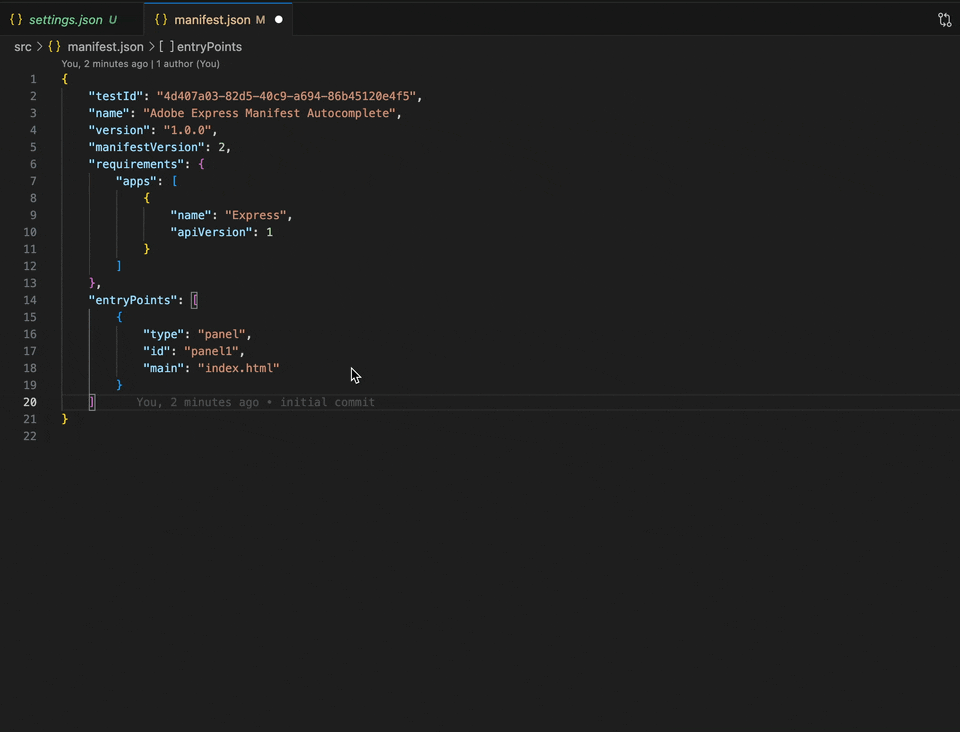

## Demo

Below is a demonstration of the manifest autocomplete feature:



## Enabling Manifest Autocomplete in VS Code/Cursor

To enable JSON schema-based autocomplete for `src/manifest.json` in VS Code/Cursor:

1. Open (or create) `.vscode/settings.json` in your project root.
2. Download the [.vscode/express-add-on-manifest.schema.json](.vscode/express-add-on-manifest.schema.json) file to your `.vscode/` directory.
3. Add the following configuration:

```json
{
  "json.schemas": [
    {
      "fileMatch": ["src/manifest.json"],
      "url": "./.vscode/express-add-on-manifest.schema.json"
    }
  ]
}
```

This will enable autocomplete and validation for `src/manifest.json` based on the schema defined in `.vscode/express-add-on-manifest.schema.json`.

## About

This project has been created with _@adobe/create-ccweb-add-on_. As an example, this Add-on demonstrates how to get started with Add-on development using React and TypeScript with Document Sandbox Runtime.

## Tools

- HTML
- CSS
- React
- TypeScript

## Setup

1. To install the dependencies, run `npm install`.
2. To build the application, run `npm run build`.
3. To start the application, run `npm run start`.
